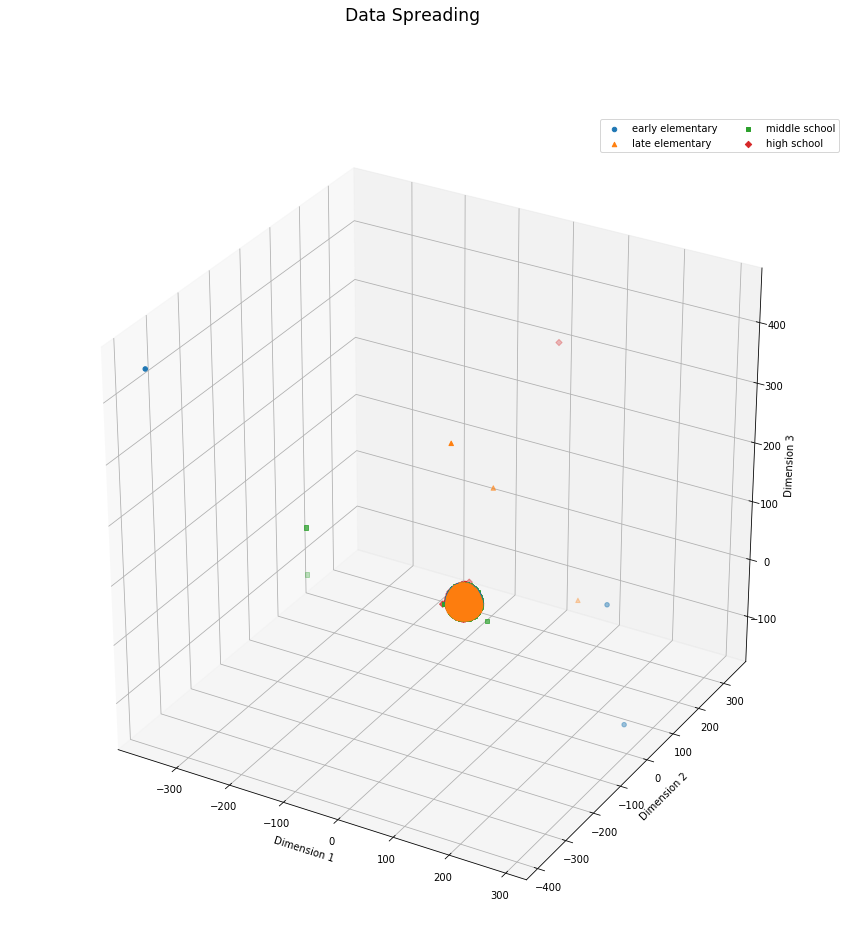

# Lexile Determination

## Background
As a teacher in high school, I was often tasked with finding reading material that was appropriate for my student's specific lexile level, or reading level. Vocabulary, sentence structure, length of phrases are all considered when determining what lexile level a text is at. Most of the time texts that have labeled lexile levels are made specifically for education. However, as teachers, we are encouraged to bring relevant news and breaking research into the classroom. This type of content does not often have a labeled lexile level. In order to differeientate to meet every student's needs, something like lexile level needs to be considered. Currently, most teachers will pre-read a text during planning and make their best guess as to what lexile level the prepared texts likely are. With this model, I aim to create a tool that will take out the guess work in predicting lexile levels, that is easy to use, and that returns results almost instantly.

## Methodology
The data science method OSEMN was used throughout the project.

### Obtain
Webscraping using the selenium library was used to acquire over 2000 full length texts from [The Gutenberg Project][link1]. Lexile levels were acquired for the texts when available by webscraping with the selenium library at [the lexile hub's][link2] Find a Book resource. A total of 264 texts were acquired and labeled.

### Scrub

Working with text data can be a nightmare, so I looked for a tool that was specific to longer text data and found NLTK's TextTiling method. This method splits a longer text up into paragraph like chunks using lexile type information like vocabulary and paragraph breaks. Because this method uses paragraph breaks to work, I was able to pass in the raw text data I had scrapped without any additional text pre-processing. With over 100,000 text tiling outputs, I proceeded breakup each paragraph into tokens maintaining the punctuation as its own token. Next, I evaluated both stemming and lemmatization and ultimately decided to only use lemmatization. Lemmatizing this particular dataset seemed to perform better. Most of these texts are open source and were written prior to 1920. In this time period, using apostrophes, dialogue, and regional slang was more more common. The stemming method from NLTK did not seem to stem as frequently when encountering this style of writing. The lemmatizing method managed this type of input at a higher rate.

### Explore
The dataset I ended up with after scrubbing tested as a polykurtic distribution as seen below.

While some methods are available to adjust for this type of distribution, such as a [hyperbolic power series][link3], they are still theoretical at this point. After further investigation, I determined that this dataset actually performed as a normal distribution up to an alpha of 0.01. I opted to not perform any transformations or further modifications to the data.

### Model
I selected a classification neural network to model with. I used four dense layers, all with 'SELU' activation, with the fifth layer being the classification layer. I selected this type of activation because of reasons.
You can see the data spreading out as it is vectorized. Below you'll see the first dimension.

Figure 1. 1D Vectorized Data for High School Lexile Levels

In Figure 2, you can see the second dimension.

Figure 2. 2D Vectorized Data

In Figure 3, you can see the third dimension. It is at this point that you can see where the different categories start to separate.

Figure 3. 3D Vectorized Data

Also, the model during training performed well. I did 250 epochs with 1028 batches. You can see the loss and accuracy during training.

## Results and Interpretation
The model generated has a training accuracy of 90% and testing accuracy of 81%. This model was saved and used to generate a Flask application that has been deployed locally.
The confusion matrices below, in Figure 4, show that the model was really good at figuring out which lexile level a text is not.

Figure 4. Confusion Matrices

## Conclusions
This project accomplished the purpose set out of identifying what lexile level any text is by copy/pasting an input to a webpage designed for the task at a satisfactory rate of 81% accuracy. Also, the category selected as second best yielded an additional 7% correct.
## Future Work
Taking this model online is the highest priority for future work. Next after that is setting up a regression style neural network to return the exact lexile level. Additionally, it might be possible to return a different lexile level text based on an input. So, predictive lexile determined text is another future option.
## References
[link1]: www.gutenberg.org
[link2]: www.lexile.com
[link3]: http://dx.doi.org/10.1016/j.csda.2017.06.001
